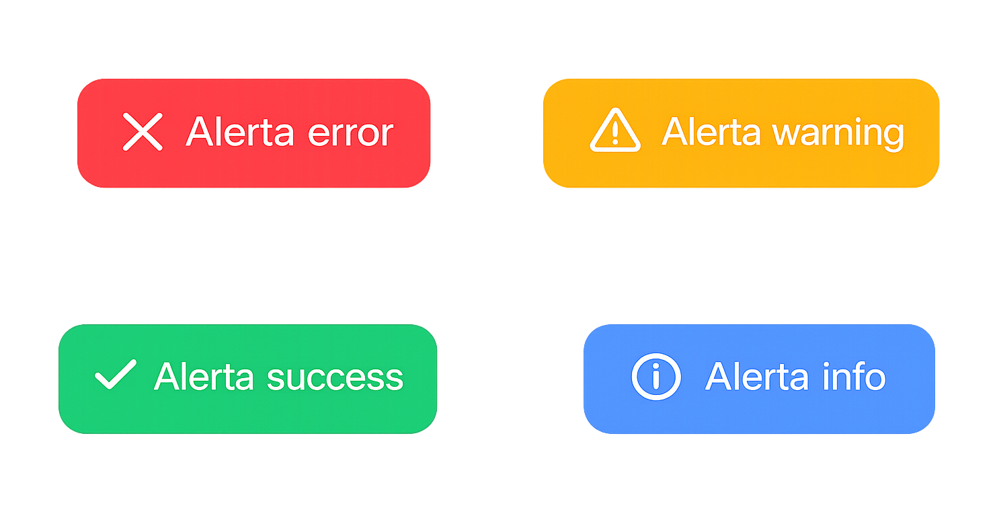

# 🔔 free-alerts

<p align="center">
  
</p>

<p align="center">
  
  
  
  
  
</p>

<p align="center">
  <a href="https://github.com/alobuuls/free-alerts"></a>
  <a href="https://www.npmjs.com/package/free-alerts"></a>
  <a href="https://github.com/alobuuls/free-alerts/stargazers"></a>
  <a href="https://github.com/alobuuls/free-alerts/commits/main"></a>
</p>

---

## 📑 Table of Contents

- [🔔 free-alerts](#-free-alerts)
  - [📑 Table of Contents](#-table-of-contents)
  - [🌐 Links](#-links)
    - [🚀 Demo](#-demo)
    - [📦 NPM Package](#-npm-package)
    - [💻 Repository](#-repository)
  - [📖 Description](#-description)
  - [✨ Features](#-features)
  - [⚙️ System Requirements](#️-system-requirements)
  - [🚀 Installation](#-installation)
    - [Install from NPM](#install-from-npm)
  - [▶️ Quick Start](#️-quick-start)
  - [🌍 CDN Usage](#-cdn-usage)
    - [CSS](#css)
    - [JavaScript](#javascript)
    - [Example](#example)
  - [📚 API Reference](#-api-reference)
- [🔔 Toast Methods](#-toast-methods)
  - [🧩 Parameters](#-parameters)
  - [🟢 Success](#-success)
  - [🔴 Error](#-error)
  - [🟡 Warning](#-warning)
  - [🔵 Info](#-info)
  - [⏱️ Custom Duration](#️-custom-duration)
- [📢 Alert Method](#-alert-method)
  - [🧩 Parameters](#-parameters-1)
  - [Example](#example-1)
- [❓ Confirm Method](#-confirm-method)
  - [Parameters](#parameters)
  - [Return Type](#return-type)
  - [Example](#example-2)
  - [💡 Usage Examples](#-usage-examples)
    - [Form Submission](#form-submission)
    - [Error Handling](#error-handling)
    - [Delete Confirmation](#delete-confirmation)
  - [⚛️ React Example](#️-react-example)
  - [🅰️ Angular Example](#️-angular-example)
  - [🧩 Option 1 — Using `@ts-ignore`](#-option-1--using-ts-ignore)
  - [🧩 Option 2 — Recommended (Type Declarations)](#-option-2--recommended-type-declarations)
    - [📝 Type Setup](#-type-setup)
    - [⚡ Angular Usage](#-angular-usage)
    - [💡 Notes](#-notes)
  - [💚 Vue Example](#-vue-example)
  - [🧪 Testing](#-testing)
    - [Run Tests](#run-tests)
    - [Example Test](#example-test)
  - [📁 Project Structure](#-project-structure)
  - [🔥 Best Practices](#-best-practices)
  - [🤝 Contributing](#-contributing)
    - [Clone Repository](#clone-repository)
    - [Install Dependencies](#install-dependencies)
    - [Start Development Mode](#start-development-mode)
    - [Run Tests](#run-tests-1)
    - [Build Package](#build-package)
  - [📄 License](#-license)

---

## 🌐 Links

### 🚀 Demo

<a href="https://alobuuls.github.io/free-alerts/demo/prod/" target="_blank" rel="noopener noreferrer">
  Open Demo
</a>

### 📦 NPM Package

<a href="https://www.npmjs.com/package/free-alerts" target="_blank" rel="noopener noreferrer">
  View on NPM
</a>

### 💻 Repository

<a href="https://github.com/alobuuls/free-alerts" target="_blank" rel="noopener noreferrer">
  GitHub Repository
</a>

---

## 📖 Description

> [!NOTE]
> free-alerts is a lightweight JavaScript library designed to display modern notifications, alerts, and confirmation dialogs with a simple and intuitive API.

The library was created to provide a clean user experience without external dependencies, making it easy to integrate into any JavaScript application or framework.

---

## ✨ Features

- 🔔 Toast notifications
- ✅ Success notifications
- ❌ Error notifications
- ⚠️ Warning notifications
- ℹ️ Info notifications
- 📢 Alert dialogs
- ❓ Confirmation dialogs
- 🚀 Zero dependencies
- 🎨 Customizable through CSS
- 📦 Framework agnostic
- ⚡ Lightweight and fast
- 🧪 Tested with Vitest
- 🌍 Browser compatible
- 🔧 Easy integration

---

## ⚙️ System Requirements

Before using the library, make sure you have:

- 🌐 Modern browser
- 📦 Node.js (for package installation)
- 📦 npm

---

## 🚀 Installation

### Install from NPM

```bash
npm install free-alerts
```

---

## ▶️ Quick Start

```js
import FreeAlerts from 'free-alerts';
import 'free-alerts/style';

FreeAlerts.success('Operation completed successfully');
```

---

## 🌍 CDN Usage

### CSS

```html
<link rel="stylesheet" href="https://cdn.jsdelivr.net/npm/free-alerts@1.0.0/dist/free-alerts.css" />
```

### JavaScript

```html
<script src="https://cdn.jsdelivr.net/npm/free-alerts@1.0.0/dist/free-alerts.umd.js"></script>
```

### Example

```html
<button id="btn">Show Toast</button>

<script>
  document.getElementById('btn').addEventListener('click', () => {
    FreeAlerts.success('Hello World!');
  });
</script>
```

---

## 📚 API Reference

| Method                      | Description                     |
| --------------------------- | ------------------------------- |
| `success(message, options)` | 🟢 Shows a success notification |
| `error(message, options)`   | 🔴 Shows an error notification  |
| `warning(message, options)` | 🟡 Shows a warning notification |
| `info(message, options)`    | 🔵 Shows an info notification   |
| `alert(options)`            | 🪟 Opens an informational modal |
| `confirm(options)`          | ❓ Opens a confirmation modal   |

---

# 🔔 Toast Methods

The following methods display temporary notifications:

```js
FreeAlerts.success();
FreeAlerts.error();
FreeAlerts.warning();
FreeAlerts.info();
```

---

### 🧩 Parameters

```ts
message: string

options?: {
  duration?: number
}
```

---

### 🟢 Success

```js
FreeAlerts.success('User created successfully');
```

---

### 🔴 Error

```js
FreeAlerts.error('Unexpected error occurred');
```

---

### 🟡 Warning

```js
FreeAlerts.warning('Please complete all fields');
```

---

### 🔵 Info

```js
FreeAlerts.info('New version available');
```

---

### ⏱️ Custom Duration

```js
FreeAlerts.success('Saved correctly', {
  duration: 5000,
});
```

---

# 📢 Alert Method

Displays an informational modal dialog.

### 🧩 Parameters

```ts
{
  title?: string;
  message?: string;
}
```

---

### Example

```js
FreeAlerts.alert({
  title: 'Attention',
  message: 'This action cannot be undone.',
});
```

---

# ❓ Confirm Method

Displays a confirmation dialog and returns a Promise.

### Parameters

```ts
{
  title?: string;
  message?: string;
}
```

---

### Return Type

```ts
Promise<boolean>;
```

---

### Example

```js
const confirmed = await FreeAlerts.confirm({
  title: 'Delete User',
  message: 'Are you sure you want to continue?',
});

if (confirmed) {
  console.log('Confirmed');
}
```

---

## 💡 Usage Examples

### Form Submission

```js
document.getElementById('form').addEventListener('submit', () => {
  FreeAlerts.success('Form submitted successfully');
});
```

---

### Error Handling

```js
try {
  await saveData();
} catch {
  FreeAlerts.error('Failed to save data');
}
```

---

### Delete Confirmation

```js
const confirmed = await FreeAlerts.confirm({
  title: 'Delete Record',
  message: 'This action cannot be undone.',
});

if (confirmed) {
  deleteRecord();
}
```

---

## ⚛️ React Example

```jsx
import FreeAlerts from 'free-alerts';
import 'free-alerts/style';

function App() {
  const handleClick = () => {
    FreeAlerts.success('Saved from React');
  };

  return <button onClick={handleClick}>Save</button>;
}

export default App;
```

---

## 🅰️ Angular Example

There are **two ways** to use FreeAlerts in Angular depending on TypeScript configuration.

---

## 🧩 Option 1 — Using `@ts-ignore`

```ts
import { Component } from '@angular/core';

// @ts-ignore
import FreeAlerts from 'free-alerts';

// @ts-ignore
import 'free-alerts/style';

@Component({
  selector: 'app-root',
  template: '<button (click)="showAlert()">Show alert</button>',
})
export class AppComponent {
  showAlert(): void {
    FreeAlerts.success('test');
  }
}
```

---

## 🧩 Option 2 — Recommended (Type Declarations)

### 📝 Type Setup

Create the TypeScript declaration file:

```text
src/types/free-alerts.d.ts
```

```ts
// This is for the FreeAlerts  ↓
declare module 'free-alerts' {
  const FreeAlerts: {
    success(message: string, options?: Record<string, any>): void;
    error(message: string, options?: Record<string, any>): void;
    warning(message: string, options?: Record<string, any>): void;
    info(message: string, options?: Record<string, any>): void;
    alert(options: { title?: string; message?: string }): void;
    confirm(options: { title?: string; message?: string }): Promise<boolean>;
  };
  export default FreeAlerts;
}

// This is for the styles  ↓
declare module 'free-alerts/style';
```

### ⚡ Angular Usage

```ts
import { Component } from '@angular/core';

//  Imports here ↓
import FreeAlerts from 'free-alerts';
import 'free-alerts/style';

@Component({
  selector: 'app-root',
  template: '<button (click)="showAlert()">Show alert</button>',
})
export class AppComponent {
  showAlert(): void {
    FreeAlerts.success('test');
  }
}
```

### 💡 Notes

- No `@ts-ignore` needed when using `.d.ts` files
- Keeps Angular clean and fully typed

## 💚 Vue Example

```vue
<template>
  <button @click="notify">Notify</button>
</template>

<script setup>
import FreeAlerts from 'free-alerts';
import 'free-alerts/style';

function notify() {
  FreeAlerts.success('Saved from Vue');
}
</script>
```

---

## 🧪 Testing

The library includes unit tests using Vitest.

### Run Tests

```bash
npm run test
```

---

### Example Test

```js
import { describe, it, expect } from 'vitest';
import FreeAlerts from '../src/index.js';

describe('FreeAlerts.alert', () => {
  it('should create modal', () => {
    FreeAlerts.alert({
      title: 'Error',
      message: 'Something happened',
    });

    const modal = document.querySelector('.free-alerts-modal');

    expect(modal).not.toBeNull();
  });
});
```

---

## 📁 Project Structure

```text
free-alerts/
├── demo/
│   ├── dev/
│   │   ├── app.js
│   │   ├── index.html
│   │   └── styles.css
│   └── prod/
│       ├── app.js
│       ├── index.html
│       └── styles.css
│
├── dist/
│   ├── free-alerts.css
│   ├── free-alerts.mjs
│   └── free-alerts.umd.js
│
├── src/
│   ├── assets/
│   │   └── preview.png
│   │
│   ├── core/
│   │   ├── alert.js
│   │   ├── confirm.js
│   │   ├── createElement.js
│   │   └── toast.js
│   │
│   ├── styles/
│   │   └── free-alerts.css
│   │
│   ├── utils/
│   │   ├── constants.js
│   │   └── icons.js
│   │
│   └── index.js
│
├── tests/
│   ├── alert.test.js
│   ├── confirm.test.js
│   └── setup.js
│
├── package.json
├── package-lock.json
├── vite.config.js
├── vitest.config.js
├── LICENSE
└── README.md
```

---

## 🔥 Best Practices

- Use success notifications for successful operations
- Use error notifications for failures
- Use confirm dialogs before destructive actions
- Keep messages concise and meaningful
- Avoid excessive notifications
- Maintain consistent user feedback
- Provide clear action outcomes

---

## 🤝 Contributing

Contributions are welcome.

### Clone Repository

```bash
git clone git@github.com:alobuuls/free-alerts.git
```

### Install Dependencies

```bash
npm install
```

### Start Development Mode

```bash
npm run dev
```

### Run Tests

```bash
npm run test
```

### Build Package

```bash
npm run build
```

If you find bugs, have ideas for improvements, or want to contribute new features, feel free to open an issue or submit a pull request.

---

## 📄 License

This project is intended for educational and portfolio purposes.

Created by **Alondra Francisco**.
